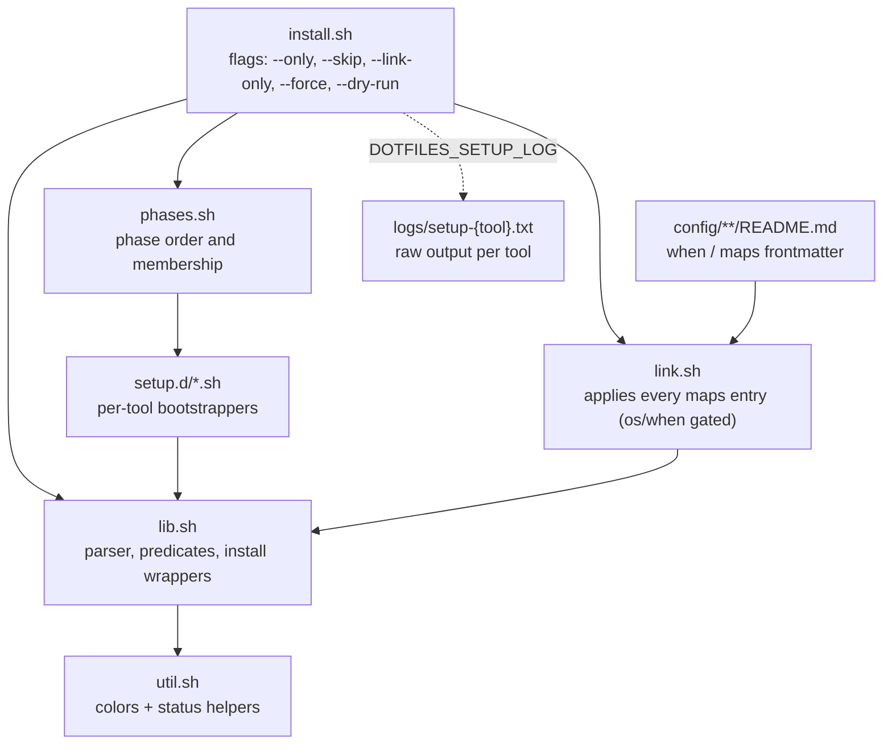

# scripts/

Installer internals behind [`install.sh`](../install.sh): shared library, per-tool
bootstrappers, the mapping applier, and the test suite. Nothing here is mappable —
mappings live in each `config/**/README.md`.

## Layout

Directories first, then files, alphabetical.

| Path | Purpose |
|---|---|
| `logs/` | Raw installer output — one `setup-{tool}.txt` per tool, fresh each run |
| `setup.d/` | One bootstrapper per tool: `system`, `oh-my-zsh`, `vim`, `nvim`, `tmux`, `fzf`, `zoxide`, `eza`, `starship`, `lazygit`, `mise`. Present-check + dry-run guard, then `brew` on macOS / `apt_install` on Linux |
| `tests/` | Self-contained test suites — see [Tests](#tests) |
| `init.sh` | Unified first-boot bootstrap (locale, timezone, upgrade, packages, sudo user, sshd, vim) — cloud-init user-data or `wget -O - ... \| bash`; `--locale <locale>`, `--profile lxc\|vps`, `--dry-run` |
| `lib.sh` | Shared library sourced by `install.sh`, `link.sh`, and every `setup.d/` script: `when:`/`maps:` frontmatter parser, `is_macos`/`is_linux`, `link_apply`, `brew_install`/`apt_install`/`ppa_install` |
| `link.sh` | Standalone applier of every `maps:` entry (os/`when:` gated) — what `--link-only` runs |
| `phases.sh` | Phase membership and order; each name maps to `setup.d/<name>.sh` |
| `php.sh` | `mise` postinstall hook for PHP (skips unless `MISE_TOOL_NAME=php`) |
| `util.sh` | Colors + one-line status helpers (`msg_begin`/`msg_end`), shared by shell rc, installer, and tests; sourced by `lib.sh` |

## Flow



Each bootstrapper prints one status line to the console (`installing (brew|apt):
<tool>... done|warn|fail`); its raw output goes to `scripts/logs/setup-{tool}.txt`,
and a failure prints `See <log> for more info`.

## First-boot bootstrap

One self-contained script (no repo checkout needed) for fresh Ubuntu hosts —
runs as cloud-init user-data or piped:

```bash
sudo ./scripts/init.sh [--profile lxc|vps] [--locale <locale>] [--dry-run]
wget -O - https://raw.githubusercontent.com/feryardiant/dotfiles/refs/heads/main/scripts/init.sh | sudo bash
wget -O - https://raw.githubusercontent.com/feryardiant/dotfiles/refs/heads/main/scripts/init.sh | bash -s -- --profile vps
```

Profiles: `lxc` (container, lean package set, creates `admin` when no login user
exists) and `vps` (fuller toolset). Default auto-detects via
`systemd-detect-virt --container`; `PROFILE=` / `DRY_RUN=1` env vars work where
args can't be passed (cloud-init `runcmd`). For cloud-init, paste the raw file
as user-data — it runs as root on first boot.

## Tests

Run a single suite:

```bash
bash scripts/tests/lib_test.sh
```

Run all six:

```bash
fail=0
for t in lib link setup plugin install init; do
  bash "scripts/tests/${t}_test.sh" || fail=1
done
[ "$fail" = 0 ]
```

| Suite | Covers |
|---|---|
| `lib_test.sh` | `lib.sh`: frontmatter parser rules, predicates, `link_apply`, install wrappers (`brew`/`apt`/`ppa`) |
| `link_test.sh` | `link.sh`: full-corpus run with gating, idempotent rerun, parse-error handling |
| `setup_test.sh` | `setup.d/*`: `bash -n` on every script plus behavior (`.env` seed/merge, nvim caches, vim-plug, lazygit apt path) |
| `plugin_test.sh` | starship, eza, fzf, zoxide install paths: `brew` on macOS, apt markers on Linux, present-check skip |
| `install_test.sh` | `install.sh` end-to-end with stubbed phases: failure handling + log hint, `--only`/`--skip` (single or comma lists), `--dry-run`, `--link-only`, unknown flags |
| `init_test.sh` | `init.sh`: CLI usage, profile resolution precedence, dry-run sequence + sudo tripwire, step-error/sudo failure paths, protocol line atomicity under chatty commands, bash 3.2 parse gate, adoption self-copy guard (real execution covered by an OrbStack VM run) |

A passing assertion prints `[PASS] <scope> - <aspect>` (status word colored,
scope bold; `**bold**` and `` `literal` `` markup in aspects renders on a TTY and
is stripped when piped); a failure prints `[FAIL] <scope> - <aspect>` followed by
`want:`/`got:` lines and ends the run non-zero. Suites share
[`tests/harness.sh`](tests/harness.sh) (`t`, `x`, `finish`) and close with
`<suite>: N tests, 0 failures` (exit 0).

Suites are hermetic: fixtures in `mktemp -d` directories, stubbed `brew`/`apt-get`/`curl`,
and a fixture-only `PATH` — no network, no writes outside the fixture, safe to run on
macOS and Linux at any time. The `init` suite's non-dry-run fixtures exercise real
commands behind their stubs (permission errors being the non-root backstop), so that
section is skipped when the suite runs as root.
